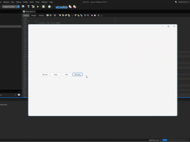
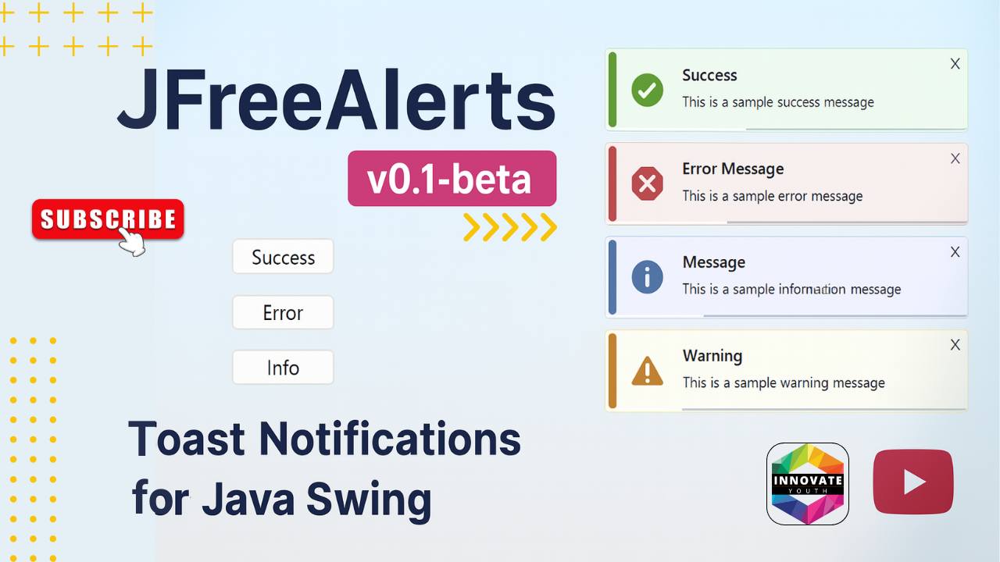

<h1>JFreeAlerts Demo 🚀</h1>

This is a demo project showcasing how to integrate and use <strong>JFreeAlerts</strong> — a toast-style notification system for Java Swing applications.

<h2>📦 Requirements</h2>
<ul>
  <li>Java 8 or higher</li>
  <li>NetBeans or any Java IDE</li>
  <li><code>jfreealerts.jar</code> added to the classpath</li>
  <li><code>flatlaf-x.x.x.jar</code> added to the classpath (for styling)</li>
</ul>

You can download the latest FlatLaf JAR from the official Maven repository:

<a href="https://mvnrepository.com/artifact/com.formdev/flatlaf/3.6.1" target="_blank">🔗 FlatLaf Releases</a>

<strong style="color:#d6336c;">⚠️ Make sure to add <code>flatlaf-x.x.x.jar</code> to your project’s classpath alongside <code>jfreealerts.jar</code>.</strong>

<h2>🧪 What This Demo Shows</h2>
<ul>
  <li>How to add <code>JNotificationPane</code> to your UI</li>
  <li>How to initialize the notification system at runtime</li>
  <li>How to trigger different types of alerts:
    <ul>
      <li><code>SUCCESS</code></li>
      <li><code>ERROR</code></li>
      <li><code>INFO</code></li>
      <li><code>WARNING</code></li>
    </ul>
  </li>
</ul>

<h2>🚀 How to Run</h2>
<ol>
  <li>Clone this repository</li>
  <li>Open the project in NetBeans</li>
  <li>Make sure <code>jfreealerts.jar</code> is added to the project libraries</li>
  <li>Run <code>DemoFrame.java</code></li>
</ol>

<h2>🎬 Demo Preview</h2>

<h2>🎥 Watch the full demo integration video on my YouTube channel from <a href="https://youtu.be/-ysjI-ckTyE">here</a></h2>
<a href="https://www.youtube.com/watch?v=-ysjI-ckTyE">
  

</a>

<h2>🔗 Related Project</h2>

See the main library repo: <a href="https://github.com/ntsachira/j-free-alerts">JFreeAlerts</a>

<h2>📄 License</h2>

This demo is released under the MIT License.

