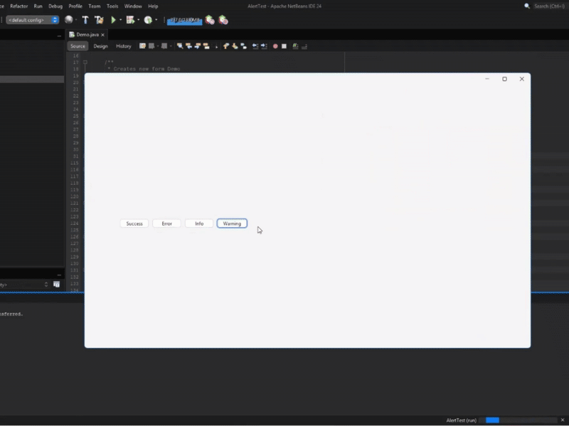

<h1>JFreeAlerts Demo 🚀</h1>

This is a demo project showcasing how to integrate and use <strong>JFreeAlerts</strong> — a toast-style notification system for Java Swing applications.

<h2>📦 Requirements</h2>
<ul>
  <li>Java 8 or higher</li>
  <li>NetBeans or any Java IDE</li>
  <li><code>jfreealerts.jar</code> added to the classpath</li>
</ul>

<h2>🧪 What This Demo Shows</h2>
<ul>
  <li>How to add <code>JNotificationPane</code> to your UI</li>
  <li>How to initialize the notification system at runtime</li>
  <li>How to trigger different types of alerts:
    <ul>
      <li><code>SUCCESS</code></li>
      <li><code>ERROR</code></li>
      <li><code>INFO</code></li>
      <li><code>WARNING</code></li>
    </ul>
  </li>
</ul>

<h2>🚀 How to Run</h2>
<ol>
  <li>Clone this repository</li>
  <li>Open the project in NetBeans</li>
  <li>Make sure <code>jfreealerts.jar</code> is added to the project libraries</li>
  <li>Run <code>DemoFrame.java</code></li>
</ol>

<h2>🎬 Demo Preview</h2>

<h2>🔗 Related Project</h2>

See the main library repo: <a href="https://github.com/yourusername/JFreeAlerts">JFreeAlerts</a>

<h2>📄 License</h2>

This demo is released under the MIT License.

